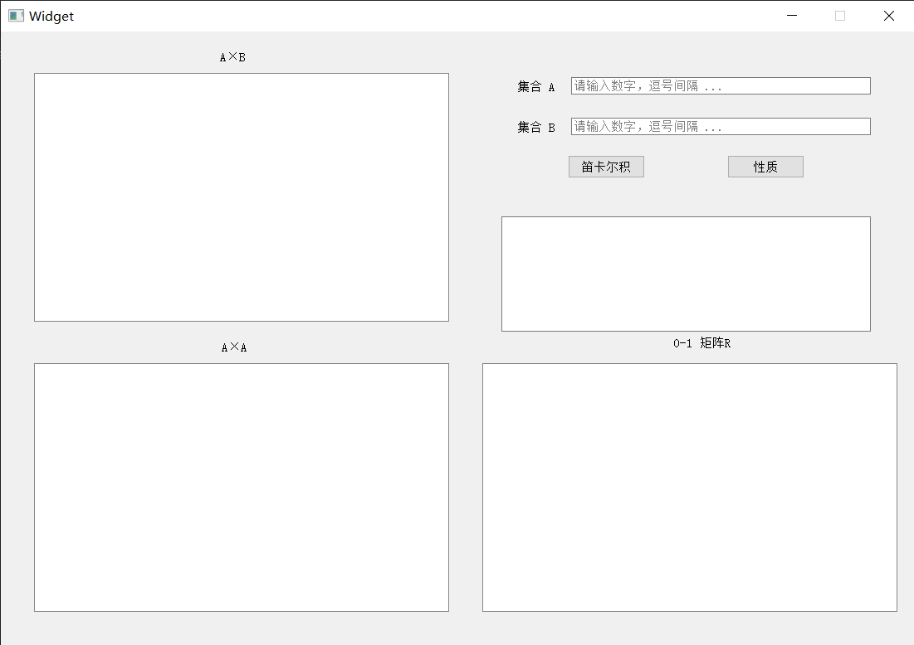
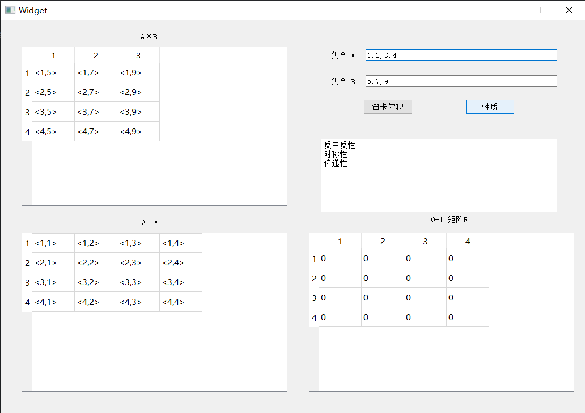

# 离散数学:关系的性质(自反性,对称性,传递性) 

### Introduction

UPC离散数学:关系的性质(自反性,对称性,传递性) UI界面展示 

开发平台：[Visual Studio 2019](https://visualstudio.microsoft.com/) + [Qt6](https://www.qt.io/product/qt6) 开发语言C++

PS:由于是第一次使用，界面设计相对简陋

### Demo





### Usage

```
run Qt_project_003.exe
```
